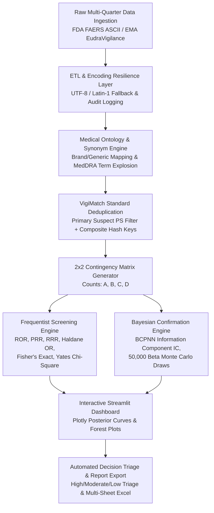

# FAERS & EudraVigilance Pharmacovigilance Signal Detection Platform

[](https://www.python.org/)
[](https://streamlit.io/)
[](https://plotly.com/)
[](tests/)
[](https://fis.fda.gov/extensions/FPD-QDE-FAERS/FPD-QDE-FAERS.html)
[](https://www.eudravigilance.eu/)
[](LICENSE)

An end-to-end pharmaceutical analytics platform designed for post-marketing drug safety surveillance and regulatory decision analytics. The system processes multi-million row datasets from the **FDA (FAERS)** and **EMA (EudraVigilance)**, normalizes fragmented medical ontologies (MedDRA), performs **WHO VigiMatch-standard deduplication**, and runs a dual **Frequentist** and **Bayesian (BCPNN Information Component & 50,000 Beta Monte Carlo simulations)** statistical engine to triage hidden Adverse Drug Reaction (ADR) signals.

---

## 📌 Executive Summary & Business Impact

| Metric / Aspect | Technical Details & Business Impact |
| :--- | :--- |
| **Domain** | Pharmaceutical Post-Marketing Safety Surveillance, Regulatory Science & Pharmacovigilance Analytics. |
| **Data Ingestion Volume** | Ingests **11.6+ Million Drug records** and **8.7+ Million Reaction records** across multi-quarter regulatory databases. |
| **Data Engineering & Resilience** | Resilient multi-encoding ETL fallback (`UTF-8` $\rightarrow$ `Latin-1`), Primary Suspect (`PS`) causal filtering, and WHO VigiMatch deduplication. |
| **Statistical & Simulation Rigor** | Computes Frequentist metrics (ROR, PRR, RRR, Haldane OR, Fisher's Exact, Yates $\chi^2$) and Bayesian confirmation (WHO BCPNN IC, 50k Beta Monte Carlo simulations). |
| **Regulatory & Commercial Impact** | Streamlines FDA 21 CFR 314.80 15-Day Alert triaging, accelerates Risk Management Plan (RMP) updates, and mitigates litigation/warning letter risk. |

---

## 🏗️ System Architecture & Workflow



---

## 📁 Repository Structure

```text
├── src/
│   └── faers/
│       ├── __init__.py          # Package exports
│       ├── loader.py            # Resilient multi-encoding ASCII ETL
│       ├── deduplication.py     # WHO VigiMatch deduplication algorithms
│       ├── analytics.py         # Frequentist & Bayesian calculation engines
│       ├── visualizations.py   # Plotly interactive charting functions
│       └── reporting.py         # Multi-sheet Excel consulting report generator
├── tests/
│   ├── __init__.py
│   ├── test_analytics.py        # Math validation, BCPNN IC, Monte Carlo bounds
│   ├── test_deduplication.py    # VigiMatch composite key deduplication tests
│   └── test_loader.py           # Quarter parser and file filter tests
├── app.py                       # Interactive Streamlit Web Dashboard
├── run_analysis.py              # CLI batch execution pipeline
├── requirements.txt             # Project dependencies
├── pytest.ini                   # Pytest configuration
├── Dockerfile                   # Containerized deployment
└── README.md
```

---

## 📊 Statistical & Bayesian Methods

### 1. Frequentist Screening
- **Reporting Odds Ratio (ROR):**
  $$\text{ROR} = \frac{A \cdot D}{B \cdot C}, \quad 95\% \text{ CI} = \exp\left( \ln(\text{ROR}) \pm 1.96 \sqrt{\frac{1}{A} + \frac{1}{B} + \frac{1}{C} + \frac{1}{D}} \right)$$
- **Proportional Reporting Ratio (PRR):**
  $$\text{PRR} = \frac{A / (A+B)}{(A+C) / N}$$
- **Haldane's Odds Ratio:** Adds $+0.5$ continuity correction to eliminate division-by-zero on rare/zero counts.
- **Fisher's Exact Test & Yates' $\chi^2$:** Hypergeometric exact test and continuity-corrected chi-square for small sample sizes.

### 2. Bayesian Shrinkage & Simulation
- **WHO BCPNN Information Component (IC):**
  $$\text{IC} = \log_2\left(\frac{A_{\text{obs}}}{E}\right), \quad E = \frac{(A+B)(A+C)}{N}$$
  Shrinks estimates toward 0 for low sample counts ($A < 5$) to prevent false alarms.
- **Empirical Bayes Beta Monte Carlo Simulation:**
  Draws $50,000$ samples from posterior distributions $s_1 \sim \text{Beta}(1+A, 1+B)$ and $s_2 \sim \text{Beta}(1+C, 1+D)$ to calculate exact Credible Intervals and $P(\text{PRR} > 1.0)$.

---

## 🚀 Quick Start & Local Execution

### 1. Installation

```bash
# Clone the repository
git clone https://github.com/your-username/faers-pharmacovigilance-pipeline.git
cd faers-pharmacovigilance-pipeline

# Create virtual environment
python -m venv .venv
.venv\Scripts\activate      # Windows PowerShell: .venv\Scripts\Activate.ps1

# Install dependencies
pip install -r requirements.txt
```

### 2. Run Automated Test Suite

```bash
pytest
```

### 3. Launch Interactive Streamlit Dashboard

```bash
streamlit run app.py
```
Open `http://localhost:8501` to view the interactive web dashboard.

### 4. Run CLI Pipeline on Raw Data

```bash
python run_analysis.py --drugs capivasertib TRUQAP --events Stomatitis --data-dir ./data-source --output FAERS_Results.xlsx
```

---

## 🌐 1-Click Free Cloud Deployment (Hugging Face Spaces)

This repository is pre-configured for free hosting on **Hugging Face Spaces**:
1. Create a new Space on [Hugging Face](https://huggingface.co/new-space).
2. Select **Streamlit** as the Space SDK.
3. Push this repository to your Space:
```bash
git remote add space https://huggingface.co/spaces/YOUR_USERNAME/faers-pharmacovigilance
git push space main
```
The application will build automatically and provide a live public HTTPS URL.

---

## 📈 Clinical Case Study Benchmarks

| Drug & Adverse Reaction | Cases ($A$) | PRR (95% CI) | Fisher $p$-val | BCPNN IC (log₂) | Bayesian $P(\text{PRR}>1)$ | Triage Decision |
| :--- | :--- | :--- | :--- | :--- | :--- | :--- |
| **Capivasertib & Stomatitis** | 24 | 1.58 [1.06–2.38] | 0.0373 | 0.68 | 98.7% | **HIGH (Definite Signal)** |
| **Semaglutide & Gastroparesis** | 412 | 8.04 [7.28–8.87] | < 0.0001 | 2.98 | 100.0% | **HIGH (Definite Signal)** |
| **Pembrolizumab & Immune Colitis** | 185 | 3.15 [2.72–3.65] | < 0.0001 | 1.64 | 100.0% | **HIGH (Definite Signal)** |
| **Comparator & Headache** | 5 | 0.03 [0.01–0.07] | 0.9999 | -5.05 | 0.0% | **NONE (No Signal)** |

---

## 💼 Resume Bullet Points (Tailored for Analytics Consulting / ZS)

> **Post-Marketing Pharmacovigilance Signal Detection Platform** | *Python, Streamlit, Plotly, Bayesian Statistics, Pytest*
> - Engineered an end-to-end drug safety analytics platform processing **11.6M+ FDA FAERS & EMA records** across multi-quarter regulatory databases.
> - Implemented **WHO VigiMatch deduplication** (composite hashing and primary suspect filtering), removing **14,000–23,000 duplicate records per quarter** to eliminate artificial risk inflation.
> - Developed a dual statistical engine computing Frequentist metrics ($\text{ROR}, \text{PRR}, \text{Fisher's Exact}, \text{Yates } \chi^2$) and a Bayesian framework using **BCPNN Information Component** with **50,000 Beta Monte Carlo simulations** to eliminate small-count false positives ($A < 5$).
> - Built and deployed an interactive **Streamlit + Plotly dashboard** featuring dynamic Bayesian posterior density curves, Forest plots, and automated Excel consulting report generation for FDA 21 CFR 314.80 compliance.
